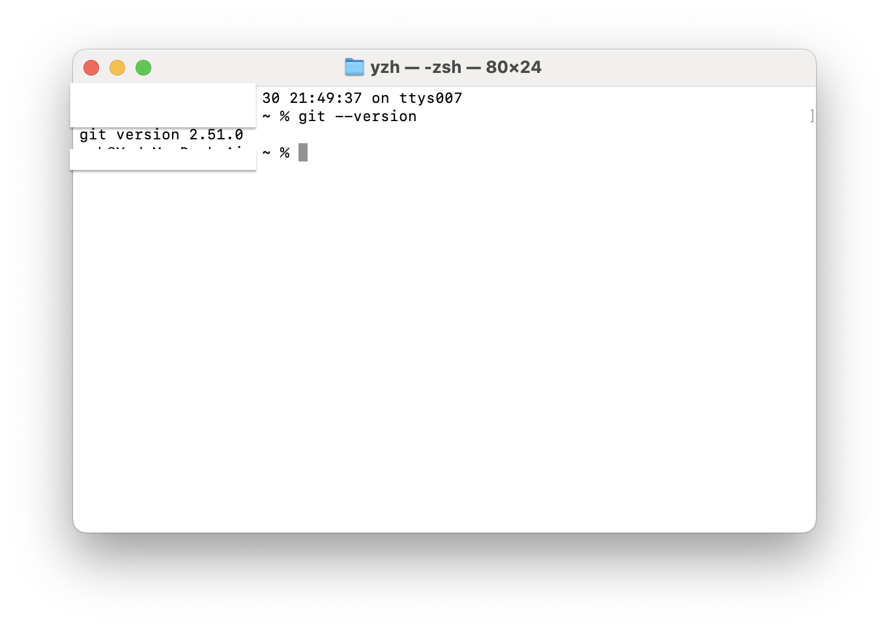
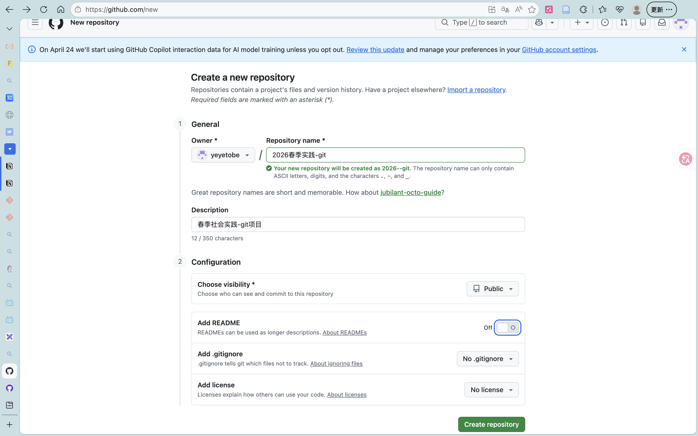
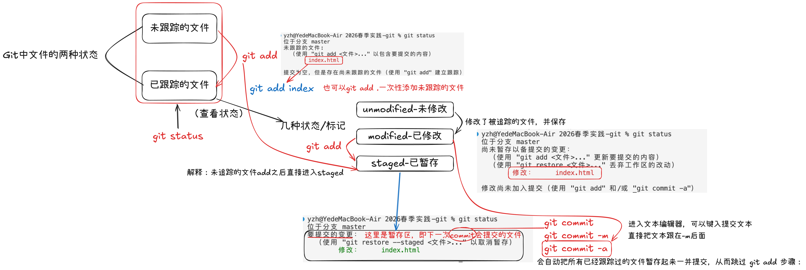

# 无标题

# 一、学习资料来源及相关链接；

1. git官方文件：

[https://git-scm.com/install/mac](https://git-scm.com/install/mac)（安装）；
[https://git-scm.com/book/zh/v2/起步-初次运行-Git-前的配置](https://git-scm.com/book/zh/v2/%e8%b5%b7%e6%ad%a5-%e5%88%9d%e6%ac%a1%e8%bf%90%e8%a1%8c-Git-%e5%89%8d%e7%9a%84%e9%85%8d%e7%bd%ae)（配置）；

[https://git-scm.com/book/zh/v2/Git-基础-获取-Git-仓库](https://git-scm.com/book/zh/v2/Git-%E5%9F%BA%E7%A1%80-%E8%8E%B7%E5%8F%96-Git-%E4%BB%93%E5%BA%93)（仓库创建）；

1. 关于git的原理和用法图解：[https://marklodato.github.io/visual-git-guide/index-zh-cn.html](https://marklodato.github.io/visual-git-guide/index-zh-cn.html)
2. chatgpt指导学习中的问题：[https://chatgpt.com/](https://chatgpt.com/)

# 二、实践流程（如安装、配置、使用过程）；

1. 安装：（终端完成）
- 前置：安装homebrew：

```bash
/bin/bash -c "$(curl -fsSL https://raw.githubusercontent.com/Homebrew/install/HEAD/install.sh)"
```

- 然后：安装git
    
    `brew install git`
       （可以通过 `git --version`来确认安装）
    
    
    
1. 配置：
    
    ```bash
    		git config --global user.name "你的名字"
        git config --global user.email "你的邮箱"
    ```
    
    确认配置：
    
    ```bash
    git config --list
    ```
    

（会显示用户名和邮箱）

1. 创建本地仓库

<aside>
💡

通常有两种获取 Git 项目仓库的方式：

1. 将尚未进行版本控制的本地目录转换为 Git 仓库；
2. 从其它服务器 **克隆** 一个已存在的 Git 仓库。
</aside>

本地目录➡️Git仓库：

在vscode里打开目标文件夹，`git init` ；或者也可以采用`cd` 到目标文件夹的方式利用Terminal创建仓库

<aside>
❗

`git init`：在这个时候，仅仅是做了一个初始化的操作，你的项目里的文件还没有被跟踪。

</aside>

然后执行：

```bash
git add .
git commit -m "Initial commit"
```

`git add .`指的是添加所有文件进入跟踪状态，也可以git add README这样指定添加特定文件

`git status`：查看状态

`git status -s`：更简短地查看状态

新添加的未跟踪文件前面有 `??` 标记，新添加到暂存区中的文件前面有 `A` 标记，修改过的文件前面有 `M` 标记。

这里对以上的内容简要说明：



1. 创建Github账号并创建一个公开仓库+选择一份适合公开的本地代码进行管理（这里新建了一个个人简介的网页）；
    
    1. 在github上注册完成后，点击new：（创建空远程仓库）
    
    ⚠️不要勾选任何初始化选项（README，.gitignore，License，）因为远程已经有完整仓库历史；**远程必须保持空白，才能直接接收**
    
    
    
    1. 复制远程仓库地址（例如[https://github.com/用户名/仓库名.git](https://github.com/%E7%94%A8%E6%88%B7%E5%90%8D/%E4%BB%93%E5%BA%93%E5%90%8D.git)）
    2. 进入本地仓库目录
    
    ```
    cd 你的项目目录
    ```
    
    1. 绑定远程仓库
    
    ```
    git remote add origin 你的仓库地址
    ```
    
    1. 推送
    
    ```
    git push-u origin master
    ```
    
2. 完成不少于3次的有效提交（commit）并上传远程仓库（push）
    
    commit方法同上
    
    上传到远程仓库（第一次之后）
    
    ```bash
    git push
    ```
    

# 三、对每次提交的主要内容进行简要说明；

1. "Initial commit”：提交了README.md目前书写的部分
2. “初始化项目结构”：新建了index.html， script.js，style.css用于测试
3. “填充网页内容，为个人网站搭建做准备”：修改了index.html， script.js，style.css，搭建个人网页的基础界面
4. “修改个人网页结构，完善三个入口的跳转”修改了index.html， script.js，style.css，同时增加：notes.html,works.html,diary.html，便于页面的跳转
5. “修正README并补充插图”：完善readme和readme用到的插图

# 四、遇到的问题及解决方法（不少于2个）；

1. **问题**：git push-u origin main时候报错：
    
    `错误：源引用规格 main 没有匹配
    错误：无法推送一些引用到 '[https://github.com/yeyetobe/2026--git.git](https://github.com/yeyetobe/2026--git.git)'`
    
    **解决**：
    
    检查默认分支：`git branch` （*master）
    
    用默认分枝重新push：`git push-u origin master`（去掉分支打印的*）
    
2. **问题**：修改后的文件在网页端查看没变化；
    
    **解决**：本地文件先保存再进行git
    
3. **问题**：git push之后没反应，后来显示：致命错误：无法访问 '[https://github.com/yeyetobe/2026--git.git/](https://github.com/yeyetobe/2026--git.git/)'：Failed to connect to [github.com](http://github.com/) port 443 after 75010 ms: Couldn't connect to server
    
    **解决**：
    
    1. 先排查问题
        1. 确认浏览器能否打开 GitHub（如果不能，就可能是
            - 网络限制
            - 代理/VPN 未开
            - DNS 问题
            - 校园网/公司网限制
        2. 浏览器可以，但是git push不行
            1. 检查：（发现无输出）
            
            ```bash
            git config --global --get http.proxy
            git config --global --get https.proxy
            ```
            
        
        iii. 测试终端连通性（failed to connect)
        
        ```bash
        curl [https://github.com](https://github.com/)
        ```
        
    2. 结论：终端环境无法直接访问 GitHub，是网络链路的问题（很多代理软件只代理浏览器/GUI Ap，不代理终Terminal）
        
        需要：配置终端代理（若你已有代理软件：
        
        - Clash
        - Surge
        - V2Ray
        - Shadowrocket
        - Quantumult
        - 其他代理工具
        
        则需要让 Git 走代理。）
        
        例如本地代理端口为 `7890`：
        
        ```
        git config--global http.proxy http://127.0.0.1:7890
        git config--global https.proxy http://127.0.0.1:7890
        ```
        
        然后再 push。
        
    

# 五、 Git学习心得

在使用终端进行版本管理之前，我使用过Github Desktop，这是一个GUI界面，通过最简单的点击进行版本管理。这样效率固然很高，但是作为计算机类的学生，也应该知道底层原理，所以我还是重新学习了Git的终端用法。通过本次学习，我终于把git的简单原理整理完成。我发现每一个看似困难的知识，只要静心学习，多画思维导图，就能成功攻克。同时，这一次readme的书写也让我领悟到写学习笔记的重要性——他不仅督促AI时代的我们对AI生成的长段回复进行更个人的消化，对思路整理很有帮助，还能让人快速回顾阶段性成果，成为回望来时路时候的一个又一个里程碑。

这次机会是一次鼓舞，亦是一次开始，我将继续在读书笔记和学习笔记上努力产出。